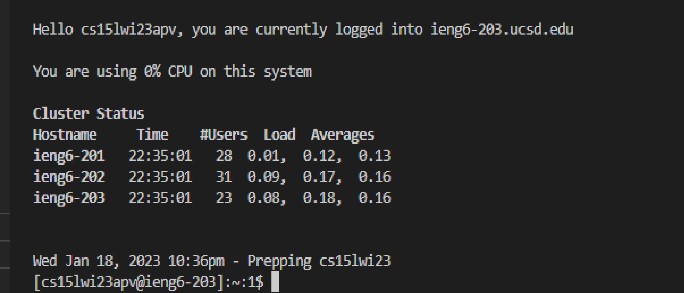

# Setting up ssh and Logging on

## Part 1: Installing VsCode

Go to [https://code.visualstudio.com/](https://code.visualstudio.com/), which is the VsCode website, and download the latest version of VS Code from it. 
After downloading it, open VS Code. It should look something like this: 


## Part 2: Opening SSH using terminal

In VS Code, open the terminal either using the button on the top left of the window, or by using the shortcut _Ctrl + Shift + `_ 

Once your terminal is open, enter this:

```
$ ssh cs15lwi23zz@ieng6.ucsd.edu
```

Where you should replace zz with your unique account. You can find your course account at [https://sdacs.ucsd.edu/cgi-bin/gpstart](https://sdacs.ucsd.edu/cgi-bin/gpstart) by entering your ucsd uername and pid.

Once you enter that, the terminal will ask you for your password: 


Enter your course password (usually the same as your AD password) and press enter. Do not worry if you cannot see your password while typing it, that is a security feature of the terminal.

### Once you are in the Remote desktop, your screen should look like this: 



(I do not know how it looks because I have not completed this step due to technical issues)

## Part 3: Testing out commands

You can now test out various commands on the command line such as:

```
$ cd # Reveals the directory you are in

$ ls # Shows the files in your directory
```
These commands are very useful when accessing files in the terminal. They allow you to check if a file is in a certain directory, and even open specific directories using absolute and local paths


To log out, you can use the command `exit`.

