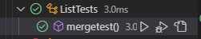
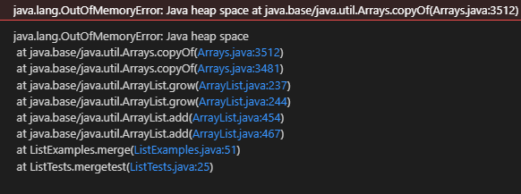

# Lab Report 2 - Servers and Bugs

## Part 1: Creating a Web Server

You can create a basic web server on your own laptop using URIHandler! Here is the code to make your own server:


### StringServer.java 
```
import java.io.IOException;
import java.net.URI;

class Handler implements URLHandler {
    // The one bit of state on the server: a number that will be manipulated by
    // various requests.

    String names = "";

    public String handleRequest(URI url) {
        if (url.getPath().equals("/")) {

            return String.format("Welcome to the String Server! \n" +
            "Please use the path /add-message?s=[string] to add a new string to the " +
            "message! \n");

        } else {
            System.out.println("Path: " + url.getPath());

            if (url.getPath().contains("/add-message")) {
                String[] parameters = url.getQuery().split("=");

                if (parameters[0].equals("s")) {

                    //names.concat(parameters[1]);
                    names = names + (parameters[1]);
                    names = names + ("\n");
                    return String.format("" + names);
                }
            }
            return "404 Not Found!";
        }
    }
}

class StringServer {
    public static void main(String[] args) throws IOException {
        if(args.length == 0){
            System.out.println("Missing port number! Try any number between 1024 to 49151");
            return;
        }

        int port = Integer.parseInt(args[0]);

        Server.start(port, new Handler());
    }
}
```

### Server.java 

```
import java.io.IOException;
import java.io.OutputStream;
import java.net.InetSocketAddress;
import java.net.URI;

import com.sun.net.httpserver.HttpExchange;
import com.sun.net.httpserver.HttpHandler;
import com.sun.net.httpserver.HttpServer;

interface URLHandler {
    String handleRequest(URI url);
}

class ServerHttpHandler implements HttpHandler {
    URLHandler handler;
    ServerHttpHandler(URLHandler handler) {
      this.handler = handler;
    }
    public void handle(final HttpExchange exchange) throws IOException {
        // form return body after being handled by program
        try {
            String ret = handler.handleRequest(exchange.getRequestURI());
            // form the return string and write it on the browser
            exchange.sendResponseHeaders(200, ret.getBytes().length);
            OutputStream os = exchange.getResponseBody();
            os.write(ret.getBytes());
            os.close();
        } catch(Exception e) {
            String response = e.toString();
            exchange.sendResponseHeaders(500, response.getBytes().length);
            OutputStream os = exchange.getResponseBody();
            os.write(response.getBytes());
            os.close();
        }
    }
}

public class Server {
    public static void start(int port, URLHandler handler) throws IOException {
        HttpServer server = HttpServer.create(new InetSocketAddress(port), 0);

        //create request entrypoint
        server.createContext("/", new ServerHttpHandler(handler));

        //start the server
        server.start();
        System.out.println("Server Started! Visit http://localhost:" + port + " to visit.");
    }
}
```


After writing and saving ur code, save it, then compile and run it as:

```
$ javac StringServer.java Server.java

$ java StringServer 4000
```
You can choose any port number between 1024 and 49151, not necessarily 4000. You can then open your website at https://localhost:{portnumber}/ 

### Here are some images of the working website: 


Various observations are: 

* This calls on the handleRequest method of the Handler class, and edits the names variable to store the word entered in the URL
* It then returns the whole set of words to the screen.
* The relevant fields changed are the URL and the names variable.
* The Handler method parses through the URL to check for changes, and runs accordingly.


## Part 2: Bugs and How to Fix Them

The following code is supposed to combine two lists of Strings in alphabetical order:

```
// Takes two sorted list of strings (so "a" appears before "b" and so on),
  // and return a new list that has all the strings in both list in sorted order.
  static List<String> merge(List<String> list1, List<String> list2) {
    List<String> result = new ArrayList<>();
    int index1 = 0, index2 = 0;
    while(index1 < list1.size() && index2 < list2.size()) {
      if(list1.get(index1).compareTo(list2.get(index2)) < 0) {
        result.add(list1.get(index1));
        index1 += 1;
      }
      else {
        result.add(list2.get(index2));
        index2 += 1;
      }
    }
    while(index1 < list1.size()) {
      result.add(list1.get(index1));
      index1 += 1;
    }
    while(index2 < list2.size()) {
      result.add(list2.get(index2));
      index1 += 1;
    }
    return result;
  }
```

```
    public void mergetest() {
        List<String> input1 = new ArrayList<>();
        input1.add("apple");
        input1.add("banana");
        input1.add("orange");
        
        List<String> input2 = new ArrayList<>();
        input2.add("bear");
        input2.add("cat");
        input2.add("lion");
        
        ArrayList<String> output = new ArrayList<String>(List.of("apple", "banana", "bear", "cat", "lion", "orange"));
        ArrayList<String> actual = new ArrayList<String>(ListExamples.merge(input1, input2));
        assertTrue(output.equals(actual));
    }
```



However, it runs into an issue with the last while loop because the while loop can never end. This is shown in the second test screenshot shown below:


```
    public void mergetest() {
        List<String> input1 = new ArrayList<>();
        input1.add("apple");
        input1.add("banana");
        input1.add("orange");
        
        List<String> input2 = new ArrayList<>();
        input2.add("bear");
        input2.add("cat");
        input2.add("lion");
        input2.add("tiger");
        
        ArrayList<String> output = new ArrayList<String>(List.of("apple", "banana", "bear", "cat", "lion", "orange", "tiger"));
        ArrayList<String> actual = new ArrayList<String>(ListExamples.merge(input1, input2));
        assertTrue(output.equals(actual));
    }
```




The code required to fix this would change the index1 in the last while loop to index2, like so:

```
// Takes two sorted list of strings (so "a" appears before "b" and so on),
  // and return a new list that has all the strings in both list in sorted order.
  static List<String> merge(List<String> list1, List<String> list2) {
    List<String> result = new ArrayList<>();
    int index1 = 0, index2 = 0;
    while(index1 < list1.size() && index2 < list2.size()) {
      if(list1.get(index1).compareTo(list2.get(index2)) < 0) {
        result.add(list1.get(index1));
        index1 += 1;
      }
      else {
        result.add(list2.get(index2));
        index2 += 1;
      }
    }
    while(index1 < list1.size()) {
      result.add(list1.get(index1));
      index1 += 1;
    }
    while(index2 < list2.size()) {
      result.add(list2.get(index2));
      index2 += 1;
    }
    return result;
  }
```


## Part 3: Takeaways from The Previous Weeks

I learnt how to make and run servers on my laptop or using ssh. This was really cool to me because I always wondered how people used to run Minecraft servers on their PCs.

Another interesting thing I learnt is how to use JUNIT testing to find bugs in programs. I am going to be using them in future CSE Programming Assignements for sure!

Cloning files and forking repositories with Github Desktop was a fun experience, and I even used it during the BPC that took place on Saturday!

Overall, these two weeks were very enjoyable and I learnt a lot.
