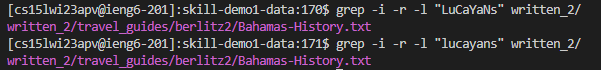

# Lab Report 3 - Researching commands

## Researching grep

grep is a command which is used to search files for lines containing a certain pattern. By default, it prints the matching lines.

It is a very versatile command which can be used to find a pattern in multiple files, or find the closest matching pattern too.

I found various applications and ways to use grep by checking the ``` man grep ``` command in the terminal.


## Different commands

### grep -i "PATTERN" FILE

This command ignores case distinctions in the pattern (string) you enter as well as the file name. So, the command would treat "LuCaYaNs" the same way as "lucayans"



(I use -r -l to find all the file in all subdirectories of written_2 and to hide the default output of the lines containing the word respectively)


### grep -l "PATTERN" FILE

This command only returns the paths of the files which contain the PATTERN specified, without showing the content.


