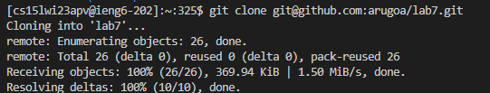
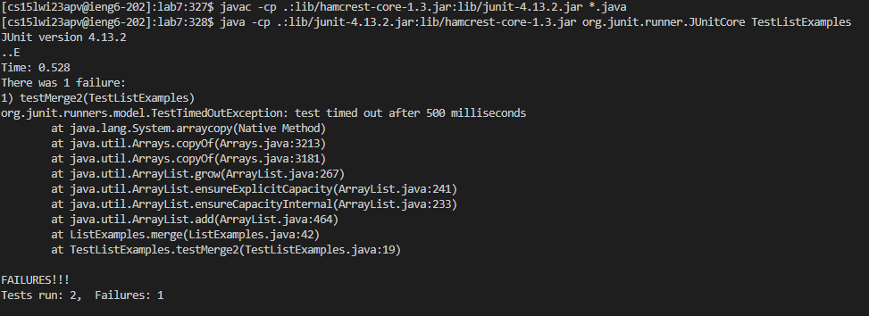
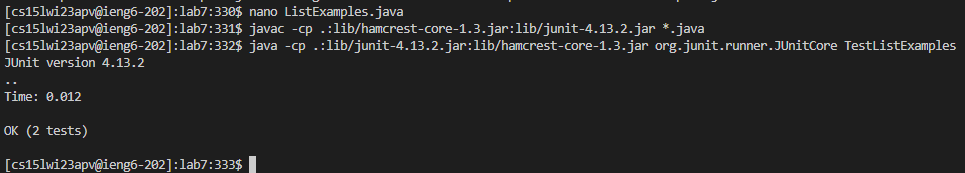
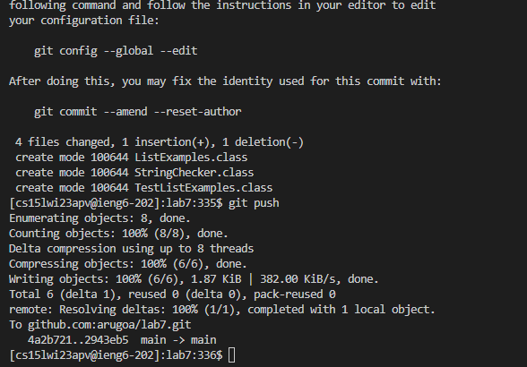

# Lab Report 4: Speed challenge


## Initial steps


Forking the [repository](https://github.com/ucsd-cse15l-w23/lab7) into my github.


## Timed challenge Tasks: 


1. I logged into ieng6 using my ssh key so I did not have to type in my password. 

```ssh cs15lwi23apv@ieng6.ucsd.edu```


2. I cloned the forked repository using the github ssh key.

```<up><up><up><up><up><up><up><Enter>```
The command was 7 commands up in history

```git clone git@github.com:arugoa/lab7.git```




3. I opened the repository

```<up><up><up><up><up><up><up><Enter>```
The command was 7 commands up in history

```cd lab7```


4. I ran the JUnit tests to show there is an error

```<up><up><up><up><up><up><up><Enter>```
The command was 7 commands up in history

```javac -cp .:lib/hamcrest-core-1.3.jar:lib/junit-4.13.2.jar *.java```

```<up><up><up><up><up><up><up><Enter>```
The command was 7 commands up in history

```java -cp .:lib/junit-4.13.2.jar:lib/hamcrest-core-1.3.jar org.junit.runner.JUnitCore TestListExamples```




5. I opened ListExamples.java using nano and edited the file, then showed the correct output

```nano Li<tab>java<Enter>```
I used tab to autocomplete the filename.

I then edited the necessary line and pressed Ctrl+O to save and Ctrl+X to quit nano.




6. I committed and pushed my code to the github repository using git commands.

```git add *.class *.java```
To add all the files that must be committed.

```git commit -m fixed```
To commit the files to the repo.

```git push```
To push them to the main repository.





## Aand we're done!!!

With a great (but not first place) time of 22 seconds !!!

wooooo!


Dont forget to exit your ssh before closing the terminal!
