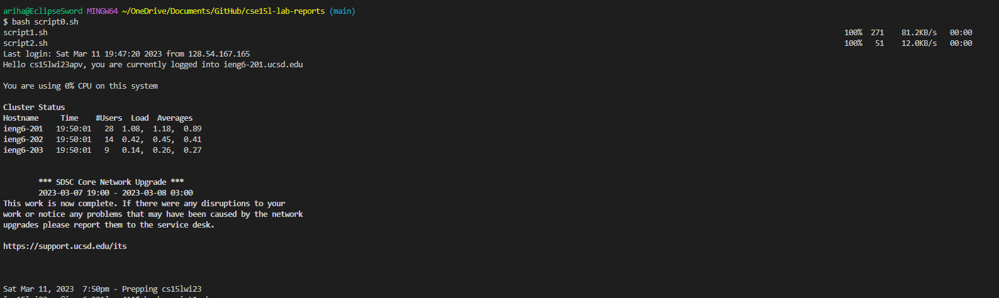
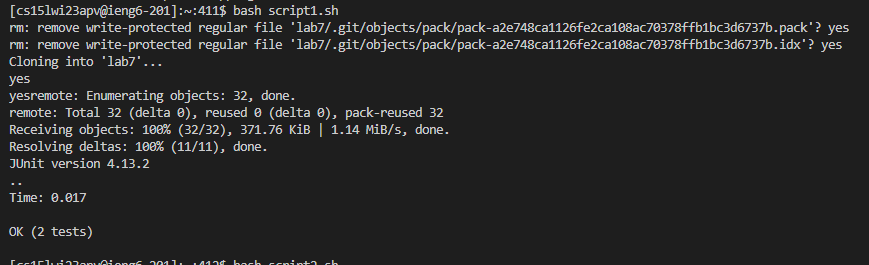
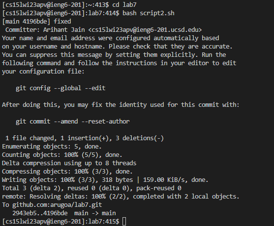

# Lab Report 5: Looking Back

## Lab report 4

Even though I completed the speed challenge manually, it could've been completed in a few seconds using a bash file. 
The bash file would contain all commands up until opening ListExamples.java

The first bash file, which would copy the other two bash files into the secure shell, would contain

```
scp script1.sh cs15lwi23apv@ieng6.ucsd.edu
scp script2.sh cs15lwi23apv@ieng6.ucsd.edu
ssh cs15lwi23apv@ieng6.ucsd.edu
```





For example, the second bash file would contain: 

```
rm -r lab7
git clone git@github.com:arugoa/lab7.git
cp script2.sh ./lab7
cd lab7
javac -cp .:lib/hamcrest-core-1.3.jar:lib/junit-4.13.2.jar *.java
java -cp .:lib/junit-4.13.2.jar:lib/hamcrest-core-1.3.jar 
  org.junit.runner.JUnitCore TestListExamples
nano ListExamples.java
```





After this, I would manually edit the file, then execute the script2.sh bash script.

```
<down> x 42 
<right> x 12
<Backspace> then typed 2
Ctrl+O <Enter> Ctrl+X
bash script2.sh
```

The contents of script2.sh would be:

```
git add *.class *.java
git commit -m fixed
git push
```





And we would be done!

By only entering 3 total commands and editing one character in a file, we achieved the same thing as lab-report4 in significantly less time!

We only need to enter:
```
bash script0.sh
bash script1.sh
Editing the file
cd lab7
bash script2.sh
```

The time I took doing this was 8 seconds!
